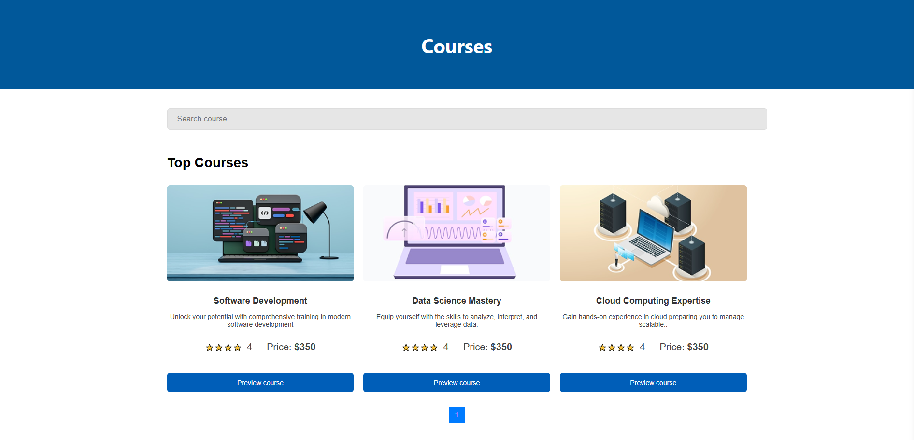

# G Client

**G Client** is an e-learning platform that enables users to register for technology-related courses and learn at their own pace. The platform also features an admin dashboard for managing courses and learners, as well as secure authentication and password reset functionality.

## Table of Contents
- [Features](#features)
- [Tech Stack](#tech-stack)
- [Project Structure](#project-structure)
  - [Backend](#backend)
  - [Frontend](#frontend)
- [Installation & Setup](#installation--setup)
  - [1. Clone the Repository](#1-clone-the-repository)
  - [2. Install Dependencies](#2-install-dependencies)
  - [3. Set Up Environment Variables](#3-set-up-environment-variables)
  - [4. Run the Application](#4-run-the-application)
- [Usage](#usage)
- [Testing](#testing)
- [Deployment](#deployment)
- [Contributing](#contributing)
- [License](#license)
- [Author](#author)

---

## Features

1. **User Registration & Login**  
   - Users can create an account, log in, and manage their profile.

2. **Course Enrollment**  
   - Learners can enroll in tech courses to access course materials.

3. **Admin Dashboard**  
   - Admins can create, update, and delete courses.
   - Admins can manage learner registrations.

4. **Password Reset**  
   - Secure password reset flow for users who have forgotten their passwords.

5. **File Upload**  
   - Users can upload profile pictures, and admins can manage course images.

6. **Secure Routing**  
   - Routes are protected for both learners and admins, ensuring data security.

---

## Tech Stack

### Frontend
- **React.js**  
- **CSS**  
- **React Router** for client-side routing  
- **Axios** for HTTP requests  

### Backend
- **Node.js** & **Express.js**  
- **MongoDB** with **Mongoose**  
- **JWT** (JSON Web Tokens) for authentication  
- **multer** for file uploads  
- **bcrypt.js** for password hashing

---

## Project Structure

The project follows a monorepo-like structure, containing both the frontend and backend in one repository.

<details>
  <summary>Click to view directory structure</summary>

### Root Directory

```
G-Client/
├── backend/
│   ├── config/
│   ├── controllers/
│   ├── middlewares/
│   ├── models/
│   ├── routes/
│   ├── uploads/
│   ├── utils/
│   ├── .env
│   ├── index.js
│   └── package.json
└── src/
    ├── components/
    │   ├── Admin/
    │   ├── Learner/
    │   └── ...
    ├── context/
    ├── pages/
    ├── css/
    ├── index.js
    ├── App.js
    ├── App.css
    └── package.json
```
</details>

### Backend

- **`index.js`**: Entry point for the Node/Express server.  
- **`controllers/`**: Contains logic for handling requests (e.g., user, admin, course controllers).  
- **`middlewares/`**: Holds custom middleware (e.g., auth checks).  
- **`models/`**: Mongoose models for MongoDB collections.  
- **`routes/`**: Defines Express routes for various resources (e.g., `/api/users`, `/api/courses`).  
- **`utils/`**: Utility functions like token generation, email sending, etc.  
- **`uploads/`**: Stores uploaded files if configured to store locally.

### Frontend

- **`src/`**: Main React application folder.  
- **`components/`**: Reusable UI components (split into `Admin/` and `Learner/`).  
- **`pages/`**: Higher-level pages or views.  
- **`context/`**: Context API for global state management (e.g., `AuthContext`).  
- **`css/`**: CSS files for styling.  
- **`index.js`**: Entry point for the React app.  
- **`App.js`**: Root component that defines routing and global layout.

---

## Installation & Setup

### 1. Clone the Repository

```bash
git clone https://github.com/FrankDzikunu/G-Client


### 2. Install Dependencies

1. **Root /**  
   ```bash
   npm install
   ```
2. **Backend**  
   ```bash
   cd backend
   npm install
   cd ..
   ```

### 3. Set Up Environment Variables

In the `backend/` folder, create a `.env` file with the following:

```
MONGO_URI=your_mongodb_connection_string
JWT_SECRET=your_secret_key
PORT=5000
```

- **`MONGO_URI`**: Your MongoDB connection string.  
- **`JWT_SECRET`**: A secret key for JWT token signing.  
- **`PORT`**: The port for the Express server (default 5000).

### 4. Run the Application

- **Backend**  
  ```bash
  cd backend
  npm run dev
  ```
- **Frontend**  
  In a separate terminal:
  ```bash
  cd ..
  npm start
  ```

The frontend will run on `http://localhost:3000`, and the backend on `http://localhost:5000`.

---

## Usage

1. **Register / Login**  
   - Access the home page at `http://localhost:3000`.
   - Register or login as a learner 
   - If you want to login as an admin use `http://localhost:3000/admin-login`

2. **Admin Dashboard**  
   - If logged in as admin, you can access the admin dashboard (e.g., `http://localhost:3000/admin`).
   - Manage courses, view learners, and handle invoices.

3. **Learner Registration**  
   - Learners can view available courses, register, and pay for them.
   - They can manage their profiles, reset passwords, and track progress.

---

## Testing

the project is set up to use:

- **Jest** & **React Testing Library** for frontend tests.
- **Jest** or **Mocha** with **Supertest** for backend tests.

To run any existing or future tests:

```bash
npm test
```

---

## Deployment

The app is hosted on: 

- **Render** for the backend.  [g-client.onrender.com](https://g-client.onrender.com)
- **Vercel** for the frontend.  [g-client-five.vercel.app"](https://g-client-five.vercel.app)

---

## 📸 Screenshots

### 🏠 Home Page


### 📄 public courses page


### 📄 admin courses page


### 📄 Dashboard


### 🔐 Auth Pages


---

## License

This project is not yet licensed. You can add a license of your choice (e.g., MIT) by creating a `LICENSE` file in the root directory.

---

## Author

**Frank Dzikunu**  
- [GitHub Profile](https://github.com/FrankDzikunu)  
- Email: frankdzikunu50@gmail.com  

---

If you have any questions, feel free to reach out or open an issue in the repository. Happy learning!
